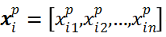

# 进化算法

## 1.遗传算法

​        遗传算法（genetic algorithm，GA）是由美国Michigan大学的J. Holland教授首先提出来的。GA是一种随机全局搜索和优化的方法，它模仿了自然界生物进化的机制，借鉴了达尔文和孟德尔的遗传学说。GA是一种高效的、并行的、全局搜索的方法，它能自动地获取和积累有关的搜索空间知识，并且能够自适应地控制搜索过程从而求得最优解。

遗传算法的基本步骤如下：

1) 设置初始种群大小M、终止代数T、交叉概率`Pc`、变异概率`Pm`；

2) 将实际问题的解从求解空间映射到编码空间，常用的编码方式有二进制编码、格雷码编码、浮点数编码和符号编码等;

3) 确定适应度函数，计算各个个体的适应度；

4) 选择（复制）策略：以一定的概率从父代种群中选择个体，如：

- 轮盘赌注法：适应度值越好的个体被选择的概率越大；
- 随机竞争选择：每次按轮盘赌注法选择一对个体，然后让这两对个体进行竞争，适应度值高的呗选中；
- 最佳保留选择：按轮盘赌注法选择以后，讲当前群体中适应度最高的个体保留；
- ......

5)交叉策略：以交叉概率`Pc`进行交叉操作，在确定交叉码位后，就通过交换双亲的部分码位产生新的个体:

- 单点交叉：指在个体编码中只随机设置一个交叉点，然后再改点相互交换两个配对个体的不分染色体；
- 两点交叉与多点交叉：设置两个（多个）交叉点，...
- 均匀交叉：两个配对个体的每个基因座上的基因都以相同的交叉概率交叉
- 算术交叉：由两个个体的线性组合而产生出两个新的个体。该操作对象一般是由浮点数编码表示的个体。

6) 变异策略：以变异概率`Pm`进行变异操作，即将个体染色体编码串中的某些基因座上的基因值用该基因座上的其它等位基因来替换，从而形成新的个体；

- 基本位变异：对个体编码串中以变异概率、随机指定的某一位或某几位仅因座上的值做变异运算
- 均匀变异：分别用符合某一范围内均匀分布的随机数，以某一较小的概率来替换个体编码串中各个基因座上的原有基因值；
- 边界变异：随机的取基因座上的两个对应边界基因值之一去替代原有基因值。
- ......

如果`t<T, t = t+1`，转到2)，如果 `t = T`，结束运算，将运算得到的适应度最大的个体（即最优解）输出。

算法框架：<https://github.com/PytLab/gaft>

## 2.粒子群算法

​        粒子群优化(Particle Swarm Optimization,  PSO)算法是Kennedy和Eberhart受人工生命研究结果的启发、通过模拟鸟群觅食过程中的迁徙和群聚行为而提出的一种基于群体智能的全局随机搜索算法，在多维空间中通过模拟鸟群的社会行为来实现一个近似最优解。设想这样一个场景：一群鸟在随机搜索食物。在这个区域里只有一块食物。所有的鸟都不知道食物在那里。但是他们知道当前的位置离食物还有多远。那么找到食物的最优策略是什么呢。最简单有效的就是搜寻目前离食物最近的鸟的周围区域。

PSO算法中的每一个对象被称作粒子，每个粒子具有位置和速度两个属性。假定算法运行在*n*维空间中，则粒子*i*的第*p*次迭代位置和速度可以分别表示为：

在迭代过程中，每个粒子根据适应度函数的计算值来判断当前位置的优劣，其中粒子*i*在前*p*次迭代过程中的最佳位置在第*d*维上的值表示为：

所有粒子在前*p*次迭代过程中的最佳位置在第*d*维上的值表示为：

粒子通过当前位置、速度和上述两个最佳位置来决定下一步的位置和速度，粒子*i*的更新公式如下：

其中，`c1`,`c2`称为学习系数；`r1`,`r2`取0到1之间的随机数；w是粒子迭代时的惯性权重，一般取常数。另外，迭代过程中每个粒子的速度必须限制在`[Vmin,Vmax]`之间。

# 3.差分进化

​        差分进化(Differential Evolution, DE)算法是由Storn和Price提出的一种简单有效的进化算法，是目前应用最强大的随机实参数优化算法之一。DE是一种基于群体的随机搜索方法，用于连续搜索领域的全局优化问题。几年来，DE在机器学习领域得到了广泛应用。DE过程和遗传算法很像，但是与遗传算法最大的不同是，DE采用了差分策略来实现个体之间的变异。

差分进化的基本步骤如下：

1)初始化种群大小M，最大迭代次数T，变异操作的的缩放因子`ϒ`，交叉概率`cr`，利用初始化适应度函数对每个个体进行初始化适应值评估；

2)变异操作。差分进化是通过差分策略异操作。主要方法是在种群中随机选择两个，用缩放因子对两个个体之差进行缩放，再将缩放后的结果加上待变异个体向量*`Xi`*产生突变向量`Vi`：

其中随机数`r1，r2，r3`属于`{1,2,3,...,p}`,缩放因子`ϒ`>0。

3)交叉操作。交叉操作是DE中的另一个重要步骤，子代通过向量载体*vi*和上一代种群向量离散重组获得：

5)重复步骤2)-4)，直到最大迭代次数*T*；

​        差分进化和遗传算法非常相似，但是遗传算法是根据适应度值来控制父代杂交，变异后产生的子代被选择的概率值，在最大化问题中适应值大的个体被选择的概率相应也会大一些。而差分进化算法变异向量是由父代差分向量生成，并与父代个体向量交叉生成新个体向量，直接与其父代个体进行选择。

​       虽然DE所需设置的参数如种群大小、交叉概率和缩放因子会对DE的优化性能产生较大的影响，但相对去其他启发式算法，DE所需设置的参数已经少很多。变异算子可以自适应调整步长和方向，选择算子的局部指标也快速高效。因此，这些特性可以使DE收敛速度更快，较其他启发式算法也更稳定。

## 实验对比

需调节参数：

GA：种群大小M；最大迭代次数T；交叉概率`Pc`；变异概率`Pm`。

PSO：学习系数`c1,c2`；粒子迭代时的惯性权重`w`，一般取常数；粒子初始位置和最大最小范围。

DE：种群大小M，最大迭代次数T，缩放因子`ϒ`，交叉概率`cr` 。

下面是用SVM对breast数据集分类模型中，用PSO和DE对SVM参数寻优结果的对比：

[pso代码参考]()

[DE代码参考]()

