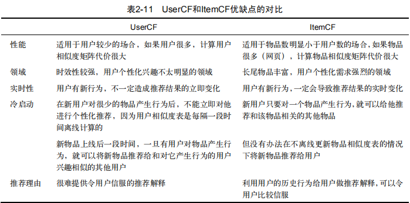

# 推荐系统

传统推荐方法主要有：

- 基于内容推荐：根据用户已经选择或评分的项目，挖掘其他内容上相似的项目作用推荐。包括显式反馈和隐式反馈。
- 协同过滤推荐：利用相似用户之间具有相似兴趣偏好的方法，来发现用户对项目的潜在偏好。主要包括启发式和基于模型两种类型。
- 混合推荐：

# 1.推荐系统的应用

电子商务、电影和视频网站、个性化音乐网络电台、社交网络、个性化阅读、基于位置服务、个性化邮件、个性化广告

推荐系统的参与者：用户，网站和内容提供方

## 评测标准：

- **实验方法**：

  - **离线实验**：只要从一个实际系统日志中提取数据即可，可快速计算出来。但无法获取很多商业上关注的指标，如点击率、转化率等。

    |           优点           |              缺点              |
    | :----------------------: | :----------------------------: |
    | 不需要对实际系统的控制权 |    无法计算商业上关注的指标    |
    |    不需要用户参与实验    | 离线实验指标和商业指标存在差距 |
    | 速度快，可以测试大量算法 |                                |

  - **用户调查**

    优点：是可以获得很多体现用户主观感受的指标，相对在线实验风险很低，出现错误后很容易弥补；

    缺点：是招募测试用户代价较大，很难组织大规模的测试用户，因此会使测试结果的统计意义不足。

  - **在线实验**：

    AB测试，通过一定的规则将用户随机分成几组， 并对不同组的用户采用不同的算法，然后通过统计不同组用户的各种不同的评测指标比较不同算法。

    优点：可以公平获取不同算法实际在线时的性能指标，包括商业上关注的指标。

    缺点：是周期比较长，必须进行长期的实验才能得到可靠的结果。因此一般不会用 AB测试测试所有的算法，而只是用它测试那些在离线实验和用户调查中表现很好的算法。

    **推荐系统实现的实验流程**：

    - [ ] 通过离线实验证明他在很多离线指标上优于现有算法；
    - [ ] 通过用户调查缺点他的用户满意度不低于现有算法；
    - [ ] 通过在线的AB测试确定他在我们关心的指标上优于现有算法。

- **评测指标**

  - **用户满意度**：是评测推荐系统的最重要指标。但用户满意度没办法离线计算，只能通过**用户调查**或**在线做实验**获得。

  - **预测准确度**：度量一个推荐系统预测用户行为的能力：

    - [ ] **评分预测：**用户打分系统。评分预测的预测度一般通过均方根误差（RMSE）和平均绝对误差（MAE）计算。

    - [ ] **TopN推荐：**TopN推荐的预测准确率一般通过准确率（precision）/召回率（recall）度量。

      召回率：推荐的列表中有多少是用户真正感兴趣的；

      准确率：用户感兴趣的有多少推荐了。

  - **覆盖率：**描述一个推荐系统对物品长尾的发掘能力。定义：推荐系统能够推荐出来的物品占总物品集合的比例。可以用信息熵或者基尼指数来定义。

    ​       覆盖率：最终推荐列表中包含多大比例的商品。

  - **多样性：**性描述了推荐列表中物品两两之间的不相似性。推荐系统的整体多样性可以定义为所有用户推荐列表多样性的平均值。

  - **新颖性：**指给用户推荐那些他们以前没有听说过的物品。

    ​             如果推荐是物品都很热门，说明推荐的新颖度比较低。

  - **惊喜度：**目前无明确指标

  - **信任度：**1.增加推荐系统的透明度，提供推荐解释；2.考虑用户社交网络信息,利用好友信息给用户做推荐。

  - **实时性：**1.实时更新列表来满足用户新的行为变化；2.将新加入的物品推荐给用户。

  - **健壮性：**衡量一个推荐系统抗击作弊的能力。

- **评测维度：**

# 2.用户行为

用户行为在个性化推荐系统中一般分为：

显性反馈行为:用户明确表示对物品喜好的行为。

隐性反馈行为:如页面浏览行为

## 2.2 用户行为分析

- [ ] 长尾分布：在英文中大部分词的词频其实很低，只有很少的词被经常使用。

$$
f(x) = \alpha x^k
$$

- [ ] 用户越活越，越倾向于浏览冷门物品

仅仅基于用户行为数据的数据设计的推荐算法一般称为协同过滤算法：

- 基于领域的方法：基于用户的协同过滤，基于物品的协同过滤
- 隐语义模型
- 基于图的随机游走算法

### 2.3 UserCF & ItemCF

1. UserCF比较古老，而ItemCF则相对较新。
2. UserCF给用户推荐那些和他有共同兴趣爱好的用户喜欢的物品，而ItemCF给用户推荐那些和他之前喜欢的物品类似的物品。从这个算法的原理可以看到，UserCF的推荐结果着重于反映和用户兴趣相似的小群体的热点，而ItemCF的推荐结果着重于维系用户的历史兴趣。换句话说，UserCF的推荐更社会化，反映了用户所在的小型兴趣群体中物品的热门程度，而ItemCF的推荐更加个性化，反映了用户自己的兴趣传承。
3. UserCF比较适合用于新闻推荐等热门程度和实时性较强的场景。比如一个人看新闻不可能每天只看和之前看的相关的那些，更多的是看今天有哪些新的热门的。从原理上讲，UserCF可以给用户推荐和他有相似爱好的一群其他用户今天都在看的新闻，这样在抓住热点和时效性的同时，保证了一定程度的个性化。从技术角度讲，UserCF主要是维护用户相似度表，在这种场景下，物品的更新速度远超用户，所以维护物品相似度表难度和成本都较高。
4. ItemCF则适用于图书、电商、电影等场景。首先这些场景中用户的兴趣是比较固定和长久的，而且一般物品更新的速度不会特别快。

IUF（Inverse User Frequence）：活跃用户对物品相似度的贡献应该小于不活跃的用户。

IUF参数，用户活跃度对数的倒数的参数修正物品相似度。

Itemcf-IUF提高推荐结果的覆盖率，降低推荐结果的流行度。

**物品相似度归一化**：将ItemCF的相似度矩阵按最大值归一化，可以提高推荐的准确率，多样性和覆盖率。

## 2.5 隐语义模型

负采样：对每个用户，要保证正负样本的平衡（数目相似）；对每个用户采样负样本时，要选取那些很热门，而用户却没有行为的物品。

将矩阵R分解为矩阵P和矩阵Q的乘积，即通过用户当前的物品偏好信息将用户和物品联系起来。

隐语义模型会把物品分为K个类型，矩阵P表示对用户对各分类的喜爱程度，矩阵Q表示物品属于某一类的权重。

损失函数：
$$
P = PQ+||R||_2+||Q||_2
$$
缺点：难实时推荐

# 3.冷启动

冷启动主要分为三类：

- 用户冷启动：解决新用户做个性化推荐问题
- 物品冷启动：解决将新物品推荐给可能对他感兴趣的用户这一问题
- 系统冷启动：解决在新开发的网站上没有用户也没有用户行为，只有一些物品信息的推荐问题

### 3.1利用用户注册信息

1. 根据用户注册信息
2. 根据注册信息对用户进行分类
3. 给用户推荐他所属那个分类中用户喜欢的物品

### 3.2 利用物品的内容信息

根据物品自己的内容信息，采用NLP知识将物品内容表示成向量空间模型

# 4.基于标签的推荐系统

**UGC**（User Generated Content，用 户生成的内容）

基于用户标签行为的个性化推荐算法：

- 统计每个用户最常用的标签

- 对于每个标签，统计被打过这个标签次数最多的物品

- 对于每个用户，首先找到他最常用的标签，然后找到具有这些标签的最热门物品推荐给该用户

  **SimpleTagBased**：用户u对物品i的兴趣公式可表示为
  $$
  p(u,i)=\sum_bn_{u,b}n_{b,i}
  $$
  这里，B(u)是用户u打过的标签集合，B(i)是物品i被打过的标签集合。n{u,b}是用户u打过标签b的次数，n{b,i}是物品i被打过标签b的次数。

缺点：倾向于给热门标签对应的热门物品很大的权重，因此会造成推荐热门的物品给用户，降低推荐结果的新颖度。且利用用户的标签向量对用户兴趣建模，给热门标签过大的权重，不能反映用户个性化兴趣。

**TagBasedTFIDF**:用户u对物品i的兴趣公式可表示为
$$
p(u,i)=\sum_b\frac{n_{u,b}}{log(1+n_b^{(u)})}n_{b.i}
$$
n{b(u)}记录了标签b被多少不同的用户使用过。

**TagBasedTFIDF++**：借助TF-IDF思想对热门物品进行惩罚：
$$
p(u,i)=\sum_b\frac{n_{u,b}}{log(1+n_{b}^{(u)})}\frac{n_{b,i}}{log(1+n_i^{u})}
$$
*注：TF-IDF(Term Frequency-Inverse DocumentFrequency, 词频-逆文件频率)一种用于资讯检索和资讯探勘的常用加权技术。*
$$
词频(TF)=\frac{某个词在文章中出现的次数}{文章的总次数}
$$

$$
逆文档频率(IDF)=log(\frac{语料库的文档总数+1}{包含该词的文档数+1})+1
$$

$$
TF-IDF=TF*IDF
$$

数据稀疏性：**用户兴趣和物品的联系是通过B(u)并B(i)集合的标签建立的。但是对于新用户或者新物品，这个集合的标签数量会很少。对此可以用个对标签集做扩展。

标签扩展方法：话题模型(topic model)，基于领域的方法

**标签清理：**

- 去除标签很高的停止词
- 去除因词根不同造成的同义词
- 去除因分隔符造成的同义词