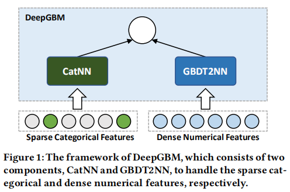

# DeepGBM

在线学习任务最主要有**tabular input space**和**online data generation**两类特征。

**tabular input space（表格输入空间）**:在线学习任务的输入输入特征包括数值型和类别型特征。

**online data generation（在线数据生成）**：真实数据任务是在线生成的，数据分布式实时动态生成的。

问题背景：

- GBDT难以处理稀疏的类别特征，不能在线更新，无法处理大规模数据

  GBDTD的主要优势是处理数值型特征非常有效，但是由于GBDT学习到的树是不可微的，所以在线预测任务的效率很低，并且还阻碍了GBDT对超大规模数据的学习，将大量数据加载到内存中进行学习不切实际。

  其次GBDT在稀疏分类特征上的学习效率低下。特别是将类别型特征进行one-hot编码以后，稀疏特征的信息增益将变得非常小，因此稀疏特征对不平衡分割的增益几乎与非分割相同。因此GBDT几乎不能有效利用稀疏特征来生长树。

- NN难以处理稠密的数值型特征

  神经网络的优势在于它对在线任务中大规模数据，但是在处理稠密特征的能力不足。全连接神经网络虽然可以直接用于稠密的数值特征，但是由于其全连接的模型结构导致了非常复杂的优化超平面，很容易陷入局部最优

- GBDT+NN不能在线更新

**DeepGB模型结构：**

 DeepGBM主要由两个主要部分组成：CatNN和GBDT2NN。CatNN是一个输入类别特征的神经网络结构，GBDT2NN是另一个从GBDT中提炼出来的神经网络，侧重于学习密集的数值型特征。

**CatNN：**

catnn主要依靠嵌入（embedding)技术，能够有效地将高维稀疏向量转化为稠密向量。此外还利用FM组件和Deep组件来学习特征上的交互。
$$
E_{Vi}(x_i)=enbedding_lookup(V_i,x_i)
$$
其中，$x_i$表示第$i$个特征的值，$V_i$存储第$i$个特征的所有嵌入表示，可以通过反向传播来学习。$E_{V_i}(x_i)$将返回对应的$x_i$嵌入向量。

基于此使用FM组件来学习线性特征和成对特征交互：
$$
y_{FM}(x)=w_0+<w,x>+\sum_{i=1}^{d}\sum_{j=i+1}^{d}<E_{Vi}(x_i),E_{V_j}(x_j)>x_ix_j
$$
其中d是特征数，$w_0$和$w$是线性部分的参数，$<.,.>$为内积运算。

Deep组件学习高阶特征交互：
$$
y_{Deep(x)}=N([E_{V1}(x_1)^T,E_{V2}(x_2)^T,...,E_{Vd}(x_d)^T]^T;\theta)
$$
其中$N(x;\theta)$是具有输入$x$和参数$\theta$的多层神经网络模型。结合两个组件，catnn的最终输出是
$$
y_{Cat}(x)=y_{FM}(x)+y_{Deep}(x)
$$
**GBDT2NN**: GBDT2NN专注于处理数值密集型特征。

*单树知识提取（Single Tree Distillation）*

树模型的**函数输出**、**学习树中的特征选择和特征重要性提取**，以及**学习树结构所隐含的数据划分能力**都可以被提取

定义$$\prod^t$$为树$t$的特征索引，$x\prod^t$作为神经网络的输入。 形式上，把树t表示为$C^t(x)$的结构函数，它返回样本的输出叶子索引，即树生成的聚类结果。使用神经网络模型来逼近结构函数$C^t(x)$，学习过程可表示为：
$$
min_\theta\frac{1}{n}\sum_{i=1}^n\xi^`(N(x^i[\prod t];\theta),L^{t，i})
$$
其中n是训练样本数目，$x^i$是第i个训练样本，$L^{t,i}$是样本$x^i$的树$C^t(x)$叶子输出的one-hot表示。$\prod ^t$是树t中使用的特征的索引。$\theta$是神经网络模型N的模型参数，可以通过反向传播更新，$\xi^`$是交叉熵之类的多分类问题的损失函数。

将树t的叶子值表示为$q^t$，那么$q^t_i$表示第$i$个叶子的叶子值,要得到树模型的输出，只需要用$p^t=L^T*q^t$将$L^t$映射到树的值输出。

结合上述的单棵树蒸馏方法，从t树蒸馏得到的神经网络是输出可以表示为
$$
y^t(x)=N(x[\prod t];\theta)*q^t
$$
*多棵树知识提取（Multiple Tree Distillation）*

对于多颗决策树的知识蒸馏，如果每棵树都用一个NN来拟合，那么复杂度太高，需要进行两个改进：

1.首先决策树的叶子可能会很多，添加一个leaf embedding层，减少最终的输出节点个数；

2.为了减少最终的NN个数，我们对决策树进行分组，多个决策树共享一个NN。采用方法为随机s棵树并为一组，这s棵树的叶子节点进行拼接操作，再连接到一个leaf embedding层。

**知识蒸馏（knowledge distillation）**

原模型需要很大的计算量和计算资源，对部署非常不利，因此考虑多模型压缩。

对于每一条数据，记原模型产生的某个logits是$v_i$,新模型产生的logits是$z_i$，我们需要最小化：
$$
\frac{1}{2}(z_i-v_i)^2
$$
考虑广义的softmax函数：
$$
q_i=\frac{exp(z_i/T)}{\sum_{j}exp(z_j/T)}
$$
当T趋向于0时，softmax输出将收敛为one-hot向 量；T趋向于无穷时，softmax的输出更软。因此在训练新模型的时候，可以使用较高的T使softmax的分布足够软，这时让新模型的softmax输出近似原模型；在训练结束以后再使用T=1来预测。

具体地，在训练时我们需要最小化两个分布的交叉熵，记新模型产生的分布是q，原模型产生的分布是p,则我们需要最小化
$$
C=-p^Tlogq
$$
我们先让T升高，然后在测试阶段回复“低温”，从而将原模型中的知识提取出来，因此将其称为蒸馏。

